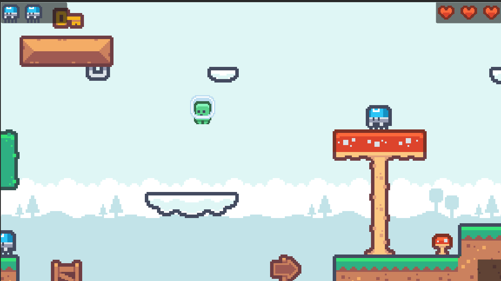

# platformer-jumpstart

A very simple platformer game made for haven-jumpstart.

## Controls:

`A` / `S` or `←` / `→` to move
`W` / `⎵` / `↑` to jump

## Objective:

1. Kill all the blue enemies by jumping on them
2. Collect the key
3. Go to the flag
4. Don't die

## License

This project is licensed under [GNU GPL v3 or later](./COPYING)

